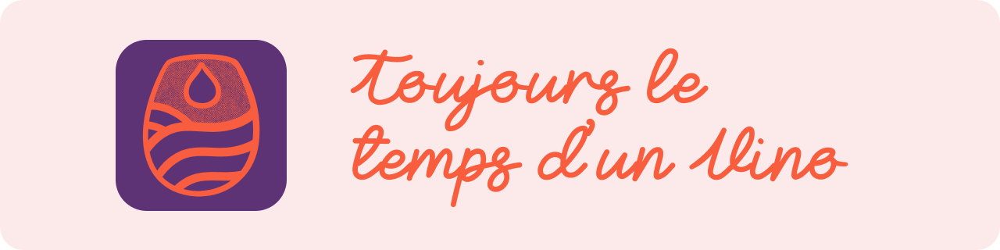

# Projet Web 2 – Vino

<p align="center">
  
</p>

<p align="center">
  <a href="https://e2495576.webdev.cmaisonneuve.qc.ca">
    
  </a>
</p>

---

## 📝 Description

**Vino** est une application web développée avec **Laravel 10, JavaScript et CSS vanille**.
Elle simplifie la gestion personnelle de bouteilles de vin et permet d’organiser un cellier de manière intuitive et efficace, à la maison ou en déplacement.

---

## 🎯 Objectifs principaux

* Créer un ou plusieurs celliers
* Ajouter, modifier et supprimer des bouteilles de vin
* Suivre les quantités disponibles
* Consulter l’inventaire sur **mobile, tablette et desktop**

---

## 👥 Public cible

Femmes et hommes de 25 à 55 ans, passionné·e·s ou curieux·ses du monde du vin, valorisant :

* Simplicité et fluidité
* Interface soignée
* Expérience utilisateur intuitive

---

## 💡 Identité de la marque

* Ton **convivial, raffiné et accessible**
* Évoque **tranquillité, organisation et passion**
* Interface claire et élégante reflétant un mode de vie soigné

---

## 🧰 Stack technologique

<p align="center">
    
    
  
  
</p>

---

## 📆 Planification Agile & Sprints

| Sprint                  | Dates             | Phase de travail                                                                              | Statut      |
| ----------------------- | ----------------- | --------------------------------------------------------------------------------------------- | ----------- |
| **Sprint 0**            | 2–4 juillet       | Idéation, modélisation BD, UI Kit, structure projet, logique Laravel (CRUD)                   | ✅ Finalisé  |
| **Sprint 1**            | 7 juillet–8 août  | US1 : Création et authentification des utilisateurs<br>US2 : Ajout d’un ou plusieurs celliers | ✅ Finalisé  |
| *Pause estivale*        | 15 juillet–4 août | Suspension de Sprint 1 pendant 3 semaines                                                     | ☀️ Pause    |
| **Sprint 1**            | 4–8 août          | US2 : Création de plusieurs celliers/utilisateur                                              | ✅ Finalisé  |
| **Sprint 2**            | 11–21 août        | Tests, validations, accessibilité, corrections et optimisations finales                       | 🚧 En cours |
| **Présentation finale** | 22 août à 13h     | Livraison, démonstration fonctionnelle et documentation complète                              | 🎯 À venir  |

---

## 👩‍💻 Équipe de développement

| Membre       | Rôle                                      | Apodo              | GitHub                                       |
| ------------ | ----------------------------------------- | ------------------ | -------------------------------------------- |
| Patricia     | Designer & Développeuse full stack        | la créative        | [Patricia](https://github.com/patrihow)      |
| Juan         | Développeur full stack – Data/Logique     | le scientifique    | [Juan](https://github.com/juahzm)            |
| Amir         | Développeur full stack                    | le stoïque         | [Amir](https://github.com/Amir-nkn)          |
| Marc-Olivier | Développeur full stack – Communication/UX | le maître des mots | [Marc-Olivier](https://github.com/marcbab01) |
| Mathieu      | Développeur full stack – Front/Back       | le polyvalent      | [Mathieu](https://github.com/TekGeekdev)     |

---

## 🔗 Liens et ressources

* 🌐 **Site en ligne** : [Voir sur WebDev](https://e2495576.webdev.cmaisonneuve.qc.ca)
* 🗂 **Jira – Backlog et sprints** : [Voir sur Jira](https://mledeurpro.atlassian.net/jira/software/projects/VC/boards/35/backlog?selectedIssue=VC-81)
* 🎨 **Figma – Wireframes et UI Kit** : [Accéder aux maquettes Figma](https://www.figma.com/design/zI2qs2UFT3FLhqtUoLZk1p/UI-Kit-%7C-Vino?node-id=40-168&t=Eytj6EWv4emeOA8p-1)

---

## 📱 Test utilisateur sur mobile

* **Installation Eduroam** :
  Téléchargez l’application **GETEDUROAM**, autorisez la localisation et l’accès aux fichiers, puis sélectionnez le Collège de Maisonneuve pour l’installation automatique du profil. Identifiez-vous avec votre adresse institutionnelle et mot de passe réseau.
  [Guide Eduroam](https://www.cmaisonneuve.qc.ca/vie-etudiante/eduroam/)

---

## 🚀 Installation du projet (en local)

### 🔧 Prérequis

* PHP ≥ 8.x
* Composer
* MySQL ou MariaDB

### ▶️ Étapes

```bash
git clone https://github.com/PatriHow/vino-projet-team/vinoprojet.git
composer install
php artisan serve
```

---

## 📌 Notes complémentaires

* Normes d’accessibilité **WCAG 2.1 niveau AA**
* Architecture **MVC**
* Utilisation des migrations et seeders Laravel pour la gestion de la base de données

---

## 🏷 Badges

<p align="center">
  
  
  
  
</p>

---
